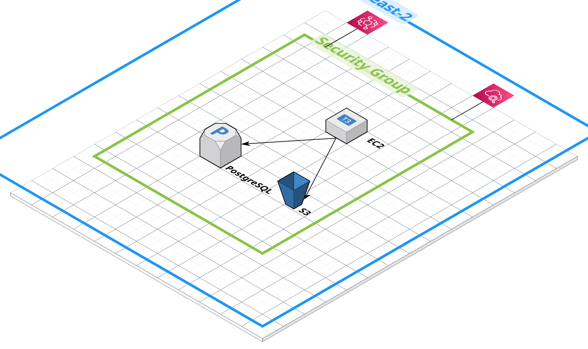

# Event Log Pipeline

## 기능

### Step 1: 이벤트 생성기
- 4가지 이벤트 타입 지원 (PAGE_VIEW, PURCHASE, CLICK, ERROR)
- 랜덤 이벤트 자동 생성 (기본 100개)
- 각 이벤트별 상세 메타데이터 포함

### Step 2: 로그 저장
- PostgreSQL 데이터베이스에 필드별 구분 저장
- 이벤트 타입별 별도 테이블 구조
- JPA를 활용한 데이터 영속화

### Step 3: 데이터 집계 분석
1. **전환 패널 분석**: 페이지 조회 → 클릭 → 구매 전환율
2. **매출 분석**: 일별 매출, 평균 구매액, 구매 빈도
3. **에러 모니터링**: 에러 발생 빈도, 영향받는 사용자, 심각도

### Step 4: Docker 실행 환경
- Docker Compose로 전체 스택 실행
- 앱 + DB 통합 구성
- 자동 이벤트 생성 및 분석

### Step 5: 결과 시각화
- JFreeChart 라이브러리 활용
- 4가지 차트 이미지 자동 생성 (PNG)
  1. **이벤트 타입별 분포** (Pie Chart)
  2. **전환 퍼널 분석** (Bar Chart)
  3. **일별 매출** (Bar Chart)
  4. **에러 심각도 분포** (Pie Chart)
- `charts/` 디렉토리에 저장

## 설계 및 구현

### Step 1: 이벤트 설계

**4가지 이벤트 타입 선택 이유:**

웹 서비스에서 가장 자주 분석하는 4가지 핵심 이벤트를 선택했습니다. **PAGE_VIEW**(페이지 조회)는 트래픽 분석, **PURCHASE**(구매)는 매출 분석, **CLICK**(클릭)은 UX 개선, **ERROR**(에러)는 서비스 안정성 모니터링에 필수적입니다.

특히 Step 3의 데이터 집계 분석을 고려하여 설계했습니다:
- **전환 퍼널 분석**(PAGE_VIEW → CLICK → PURCHASE)을 위한 사용자 여정 추적
- **매출 분석**을 위한 구매 상세 정보 (상품, 가격, 수량, 결제 방법)
- **에러 모니터링**을 위한 에러 심각도 및 영향 범위 파악

각 이벤트는 실무에서 필요한 최소한의 필드로 구성하되, 추후 분석에 필요한 메타데이터를 충분히 포함하도록 설계했습니다.

> **참고**: 현재는 랜덤 이벤트를 생성하여 파이프라인 동작을 검증합니다. 실제 프로덕션 환경에서는 웹/앱에서 발생하는 실시간 사용자 이벤트를 수집하게 되며, 이를 통해 의미 있는 사용자 여정 분석과 비즈니스 인사이트를 도출할 수 있습니다.

### Step 2: PostgreSQL 선택 이유

**PostgreSQL을 선택한 이유:**

1. **점유율 상승**: DB-Engines 랭킹에서 PostgreSQL은 지속적으로 성장하며 현재 관계형 데이터베이스 중 2위를 차지하고 있습니다. 2024년 기준 전년 대비 가장 높은 성장률을 보이고 있습니다.

2. **기업 채택 증가**: Netflix, Instagram, Uber, Apple 등 글로벌 기업들이 PostgreSQL을 핵심 데이터베이스로 사용하고 있으며, 국내 스타트업과 중견 기업에서도 MySQL에서 PostgreSQL로 전환하는 추세입니다.

3. **기술적 우수성**: JSON 컬럼 지원으로 유연한 메타데이터 저장이 가능하고, 복잡한 집계 쿼리(Window Function, CTE 등)에 최적화되어 있어 이벤트 로그 분석에 적합합니다.

4. **실무 호환성**: 대부분의 ORM 프레임워크와 호환성이 뛰어나며, 엔터프라이즈급 기능(MVCC, 트랜잭션, 복제)을 오픈소스로 제공합니다.

### 스키마 설계 원칙

이벤트 타입별로 테이블을 분리한 이유는 각 타입마다 필요한 필드가 다르기 때문입니다. 공통 정보(id, user_id, timestamp 등)는 `events` 테이블에, 타입별 상세 정보는 별도 테이블(`page_views`, `purchases`, `clicks`, `errors`)에 저장하여 정규화를 유지하면서도 쿼리 성능을 최적화했습니다.

이 설계는 **이벤트 로그 시스템의 특성**과 잘 맞습니다. 이벤트는 일반적으로 **append-only**(추가 전용)이며 **immutable**(불변) 특성을 가집니다. 즉, 한 번 생성된 이벤트는 수정되지 않고 주로 읽기와 집계 분석에 사용됩니다. 따라서 공통 분석과 타입별 상세 분석을 모두 효율적으로 처리할 수 있도록 테이블을 분리하는 것이 관리와 성능 면에서 유리합니다.

공통 이벤트와 상세 이벤트는 **동일한 `event_id`를 사용**하여 1:1 관계를 유지하며, 사용자 행동 흐름 분석을 위해 `session_id`를 저장하여 단일 세션 내에서 발생한 일련의 이벤트(페이지 조회 → 클릭 → 구매)를 추적할 수 있습니다.

이러한 **공통 엔티티 + 타입별 엔티티 분리 패턴**은 과거 프로젝트에서도 활용했던 접근 방식입니다. 당시 다양한 알림 타입(이메일, SMS, 푸시)을 처리하는 시스템에서 공통 필드(발송 시간, 수신자, 상태)는 `notifications` 테이블에, 타입별 내용(제목, 본문, 템플릿)은 별도 테이블에 저장했습니다. 이 구조의 장점은:

1. **쿼리 성능**: 전체 알림 목록 조회 시 공통 테이블만 스캔하므로 빠르고, 특정 타입 상세 조회 시에만 조인하여 불필요한 데이터 로드를 방지했습니다.
2. **유지보수성**: 새로운 알림 타입 추가 시 기존 테이블 구조를 변경할 필요가 없어 배포 리스크가 낮았습니다.
3. **데이터 무결성**: 공통 제약 조건(예: 발송 시간은 필수)과 타입별 제약 조건(예: 이메일은 제목 필수)을 각각 독립적으로 관리할 수 있었습니다.

이번 과제에서도 동일한 설계 원칙을 적용하여, 이벤트 타입별로 필요한 필드가 다르지만 모든 이벤트가 공유하는 핵심 속성(발생 시간, 사용자, 세션)은 `events` 테이블에 집중시켰습니다. 이 구조는 새로운 이벤트 타입 추가 시에도 기존 테이블에 영향을 주지 않아 확장성이 뛰어납니다.

### 구현 과정에서 고민한 점

#### 데이터베이스 선택: PostgreSQL vs Elasticsearch

이벤트 로그 저장소로 어떤 데이터베이스를 사용할지 고민했습니다. **Elasticsearch**는 로그 분석에 특화된 검색 엔진으로, 대용량 로그 데이터의 실시간 검색과 집계에 강점이 있습니다. 특히 ELK 스택은 로그 파이프라인의 사실상 표준으로 자리잡고 있습니다.

하지만 이번 프로젝트에서는 **PostgreSQL**을 선택했습니다. 그 이유는:

1. **트랜잭션 보장**: 이벤트 데이터와 타입별 상세 정보를 분리 저장할 때 ACID 트랜잭션이 필요했습니다. Elasticsearch는 Near Real-time 검색 엔진이라 즉시 일관성을 보장하지 않습니다.

2. **관계형 데이터 모델**: 공통 이벤트 테이블과 타입별 테이블을 외래키로 연결하는 정규화된 스키마 설계가 필요했습니다. Elasticsearch는 NoSQL 기반이라 조인이나 참조 무결성 제약이 약합니다.

3. **학습 곡선과 운영**: Spring Data JPA를 활용한 개발이 익숙했고, 과제 범위에서는 PostgreSQL의 집계 쿼리만으로도 충분히 분석이 가능했습니다. Elasticsearch는 초기 설정과 클러스터 관리가 복잡합니다.

만약 **실시간 대용량 로그 분석**(초당 수만 건 이상)이나 **전문 검색**(Full-text search)이 필요했다면 Elasticsearch가 더 적합했을 것입니다. 하지만 소규모 과제에서는 PostgreSQL의 안정성과 생산성이 더 큰 장점이었습니다.

## 기술 스택

- **언어**: Java 17
- **프레임워크**: Spring Boot 4.0.6
- **데이터베이스**: PostgreSQL 16
- **빌드 도구**: Gradle 9.4.1
- **컨테이너**: Docker, Docker Compose
- **ORM**: Spring Data JPA, Hibernate
- **차트**: JFreeChart 1.5.4
- **기타**: Lombok, Jackson

## 실행 방법

### Docker Compose 실행 (권장)

```bash
# 전체 스택 실행 (PostgreSQL + 애플리케이션)
docker-compose up --build

# 백그라운드 실행
docker-compose up --build -d

# 로그 확인
docker logs -f eventlog-app

# 생성된 차트 확인
ls -lh charts/

# 종료
docker-compose down

# 볼륨까지 삭제
docker-compose down -v
```

**실행 결과:**
- ✅ 100개 이벤트 자동 생성
- ✅ PostgreSQL에 저장
- ✅ 3가지 분석 실행 (전환 퍼널, 매출, 에러)
- ✅ 4개 차트 이미지 생성 (`charts/` 디렉토리)

### 로컬 실행

```bash
# PostgreSQL 먼저 시작
docker-compose up postgres -d

# 애플리케이션 실행
./gradlew bootRun

# 또는
./gradlew build
java -jar build/libs/eventlog-0.0.1-SNAPSHOT.jar
```

## 데이터베이스 확인

```bash
# PostgreSQL 접속
docker exec -it eventlog-postgres psql -U postgres -d eventlog

# 테이블 확인
\dt

# 이벤트 개수 확인
SELECT COUNT(*) FROM events;

# 이벤트 타입별 통계
SELECT event_type, COUNT(*) FROM events GROUP BY event_type;

# 매출 분석
SELECT SUM(total_amount) as total_revenue FROM purchases;
```

## 프로젝트 구조

```
eventlog/
├── src/
│   └── main/
│       ├── java/kr/java/eventlog/
│       │   ├── dto/              # 데이터 전송 객체
│       │   ├── entity/           # JPA 엔티티
│       │   ├── generator/        # 이벤트 생성기
│       │   ├── model/            # 도메인 모델
│       │   ├── repository/       # 데이터 저장소
│       │   ├── runner/           # 애플리케이션 러너
│       │   └── service/          # 비즈니스 로직
│       └── resources/
│           └── application.yaml  # 설정 파일
├── Dockerfile                    # 애플리케이션 이미지
├── docker-compose.yml           # Docker Compose 설정
└── build.gradle                 # Gradle 빌드 설정
```

## 데이터베이스 스키마

### events (공통 이벤트 정보)
- `id` (PK): 이벤트 고유 ID
- `event_type`: 이벤트 타입
- `user_id`: 사용자 ID
- `session_id`: 세션 ID
- `timestamp`: 발생 시간

### page_views (페이지 조회 상세)
- `event_id` (PK, FK)
- `url`: 페이지 URL
- `referrer`: 유입 경로
- `duration_seconds`: 체류 시간
- `user_agent`: 사용자 에이전트

### purchases (구매 상세)
- `event_id` (PK, FK)
- `product_id`: 상품 ID
- `product_name`: 상품명
- `price`: 가격
- `quantity`: 수량
- `total_amount`: 총액
- `payment_method`: 결제 방법

### clicks (클릭 상세)
- `event_id` (PK, FK)
- `element_id`: 요소 ID
- `element_type`: 요소 타입
- `page_url`: 페이지 URL
- `x`, `y`: 클릭 좌표

### errors (에러 상세)
- `event_id` (PK, FK)
- `error_code`: 에러 코드
- `error_message`: 에러 메시지
- `severity`: 심각도
- `page`: 발생 페이지

## 환경 변수

| 변수명 | 기본값 | 설명 |
|--------|--------|------|
| `SPRING_PROFILES_ACTIVE` | dev | 프로필 (dev/prod) |
| `DB_URL` | jdbc:postgresql://localhost:5432/eventlog | DB URL |
| `DB_USERNAME` | postgres | DB 사용자 |
| `DB_PASSWORD` | postgres | DB 비밀번호 |

## 포트

- **애플리케이션**: 8081
- **PostgreSQL**: 5432

## 분석 결과 예시

### 콘솔 출력
```
[1] 전환 퍼널 분석 (페이지 조회 → 클릭 → 구매)
총 사용자 수: 5
페이지 조회 사용자: 5 (100.0%)
클릭한 사용자: 5 (100.0%)
구매한 사용자: 5 (100.0%)
클릭률 (CTR): 100.0%
전환율 (CVR): 100.0%

[2] 일별 매출 분석
날짜           | 구매자수 | 구매건수 | 총매출      | 평균구매액  | 인당매출
2026-05-22     | 5        | 23       | 3,290,000원 | 143,043원   | 658,000원

[3] 에러 발생 현황
총 에러 유형: 7
총 에러 발생 횟수: 7
```

### 생성된 차트
실행 후 `charts/` 디렉토리에 다음 차트들이 생성됩니다:

1. **event_type_distribution.png** - 이벤트 타입별 분포 (파이 차트)
2. **conversion_funnel.png** - 전환 퍼널 (바 차트)
3. **daily_revenue.png** - 일별 매출 (바 차트)
4. **error_severity.png** - 에러 심각도 분포 (파이 차트)

## AWS 아키텍처 설계 (선택 과제)

### 아키텍처 다이어그램


### 선택한 AWS 서비스별 역할

#### 애플리케이션 계층
**EC2 (t3.small)**: Docker Compose로 Spring Boot 애플리케이션을 실행합니다. 과거 프로젝트에서 EC2 사용 경험이 있어 익숙하며, SSH로 직접 접속하여 디버깅과 로그 확인이 가능합니다. 현재 Docker 구성을 그대로 사용할 수 있어 마이그레이션이 간단합니다.

#### 데이터베이스 계층
**RDS PostgreSQL (db.t3.micro, Single-AZ)**: 이벤트 로그를 저장하는 관리형 데이터베이스입니다. 현재 PostgreSQL 16을 사용 중이라 코드 수정 없이 바로 연결할 수 있습니다. 자동 백업(7일 보관)으로 데이터 유실을 방지하며, EC2에서 직접 PostgreSQL을 운영하는 것보다 패치와 관리가 편리합니다.

#### 스토리지 계층
**Amazon S3**: JFreeChart로 생성한 차트 이미지(PNG)를 저장합니다. EC2 인스턴스는 재시작 시 로컬 파일이 사라질 수 있으므로 S3에 영구 저장합니다. Public Access를 허용하면 브라우저에서 `https://bucket-name.s3.amazonaws.com/charts/event_type_distribution.png` 형태로 바로 확인할 수 있습니다.

#### 네트워크 계층
**VPC와 Security Group**: EC2는 Public Subnet에, RDS는 Private Subnet에 배치하여 외부에서 DB로 직접 접근할 수 없도록 차단합니다. Security Group으로 EC2에서 RDS의 5432 포트로만 접근을 허용하여 최소 권한 원칙을 적용합니다.

#### 운영 계층
**EventBridge**: 매일 자정에 이벤트 생성 작업을 자동 실행하는 스케줄러입니다. Cron 표현식(`cron(0 0 * * ? *)`)으로 스케줄을 설정하며, Lambda 함수를 통해 EC2 내부 스크립트를 트리거할 수 있습니다.

**CloudWatch**: EC2와 RDS의 로그와 메트릭을 수집합니다. CPU 사용률이 80% 이상이거나 디스크가 부족할 때 SNS로 알람을 받을 수 있으며, CloudWatch Agent를 설치하면 Spring Boot 애플리케이션 로그도 실시간으로 확인할 수 있습니다.

### 아키텍처 설계에서 고민한 부분

#### 로드 밸런서(ALB) 필요성
처음에는 **Application Load Balancer**를 고려했습니다. ALB는 여러 EC2 인스턴스로 트래픽을 분산하고 HTTPS 인증서를 관리하며, Auto Scaling과 연동하여 부하에 따라 인스턴스를 자동 증감할 수 있습니다. 하지만 이번 과제는 하루 한 번 100개 이벤트를 생성하는 배치 작업이고, 외부 트래픽이 거의 없으며, 단일 EC2 인스턴스로도 충분히 처리 가능합니다. ALB는 시간당 $0.0225 + 데이터 전송 비용이 추가되어 과제 규모 대비 과한 스펙이라 판단하여 제외했습니다. 만약 실시간 API를 제공하거나 높은 가용성이 필요하다면 ALB와 Auto Scaling을 추가하는 것이 적합합니다.

## 개발

```bash
# 의존성 설치
./gradlew dependencies

# 컴파일
./gradlew compileJava

# 테스트
./gradlew test

# 빌드
./gradlew build
```
